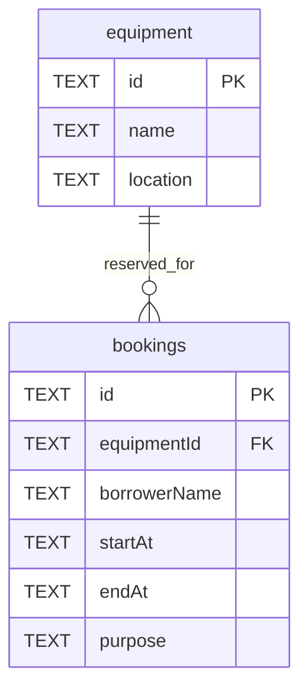

# Campus Equipment Booking API

Local Base API URL: `http://localhost:8787/api`. The instructor subsequently requested a live Cloudflare link; see SUBMISSION_LINKS.md for the exact deployed URL. The root `/` additionally returns API information for easy inspection.

| Method | Path | Success | Response |
|---|---|---|---|
| GET | /equipment | 200 | Equipment array |
| GET | /bookings | 200 | Booking array |
| GET | /bookings/:id | 200 | Booking object |
| POST | /bookings | 201 | Created booking; Location header |
| PATCH | /bookings/:id | 200 | Updated booking |
| DELETE | /bookings/:id | 204 | Empty body |

Create body (all fields required):
```json
{"equipmentId":"eq-1","borrowerName":"Somchai Jaidee","startAt":"2026-10-20T09:00:00.000Z","endAt":"2026-10-20T11:00:00.000Z","purpose":"Class presentation"}
```

PATCH accepts a nonempty subset of those fields. Responses contain these fields plus a server-generated UUID `id`. Unknown fields are rejected. Equipment IDs, borrower names and purposes must be nonblank strings (limits 100, 100, 500 characters). Dates must be real ISO 8601 UTC timestamps with seconds and optional three-digit milliseconds; they are normalized to `YYYY-MM-DDTHH:mm:ss.sssZ`. Start must be strictly before end.

Every error has shape `{"error":"clear message"}`. Invalid JSON, fields, times, or equipmentId: 400. Unknown booking or route: 404. Overlap: 409. Unexpected server failure: 500 with no internal details.

| Status | Reason and example |
|---|---|
| 400 | The request cannot form a valid booking: missing borrowerName, invalid date, start >= end, or equipmentId that does not exist. |
| 404 | The URL identifies a booking that cannot be found, or an unknown route. |
| 409 | A valid booking interval conflicts with the current schedule of that equipment. Change the time or equipment. |

POST response example (201):
```json
{"id":"server-generated-uuid","equipmentId":"eq-1","borrowerName":"Somchai Jaidee","startAt":"2026-10-20T09:00:00.000Z","endAt":"2026-10-20T11:00:00.000Z","purpose":"Class presentation"}
```
GET /bookings returns an array of objects with this shape, or `[]` when empty. PATCH `{ "purpose": "Workshop" }` returns the complete updated booking with 200. DELETE returns 204 with no body. An overlapping POST or PATCH returns `{"error":"Equipment is already booked during that time"}` with 409. A missing booking returns `{"error":"Booking not found"}` with 404. On PATCH, a missing booking is checked before the body; it therefore returns 404 even if that body is invalid.

Assumptions: no authentication requirement in the supplied brief; this is an assessment demo with fictitious names. Past dates allowed. Intervals are half-open `[startAt,endAt)`: adjacent bookings are allowed. Overlap is `existing.startAt < requested.endAt AND existing.endAt > requested.startAt`. An update excludes its own booking ID and validates the merged record. The database also enforces overlap atomically with triggers. No browser API client is included, so CORS is not needed per the brief. Public Cloudflare deployment was added following the instructor's later verbal requirement as reported by the student.

## Schema / ERD


One equipment item has zero or many bookings; each booking belongs to exactly one item. UTC normalized text sorts chronologically. The `(equipmentId,startAt,endAt)` index supports overlap lookups. Foreign keys, CHECK constraints, and triggers provide database safeguards. All request values use SQL parameter binding.
